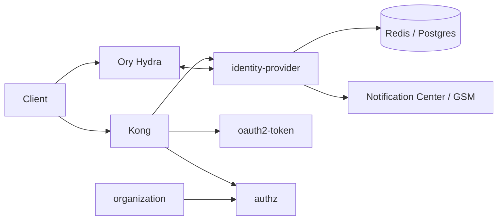
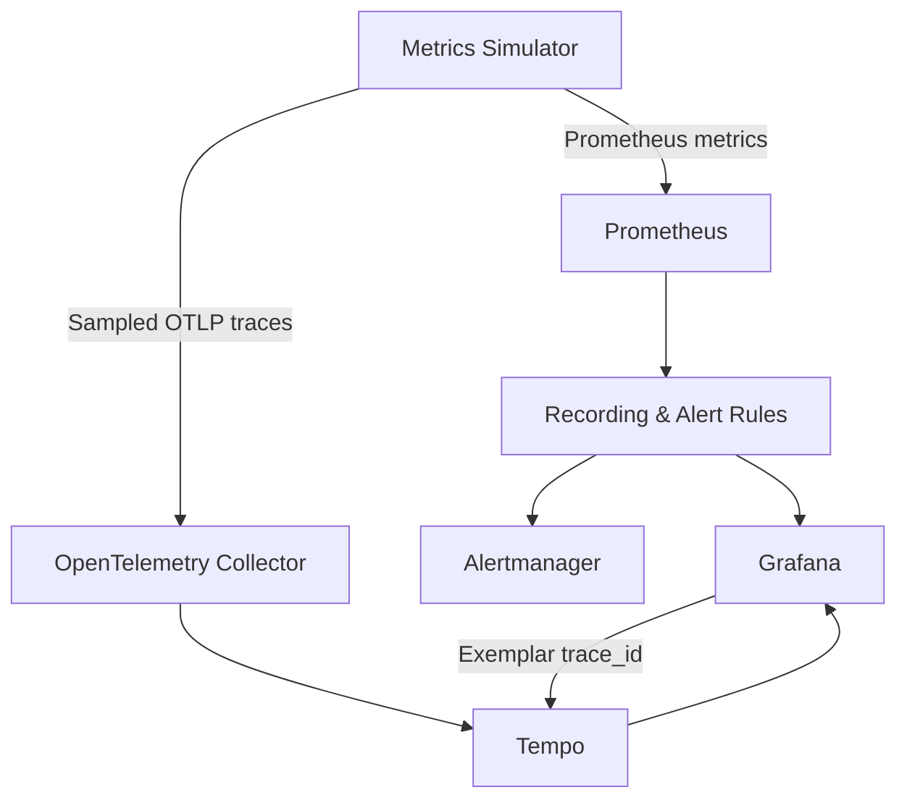
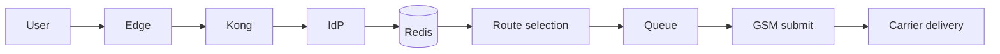
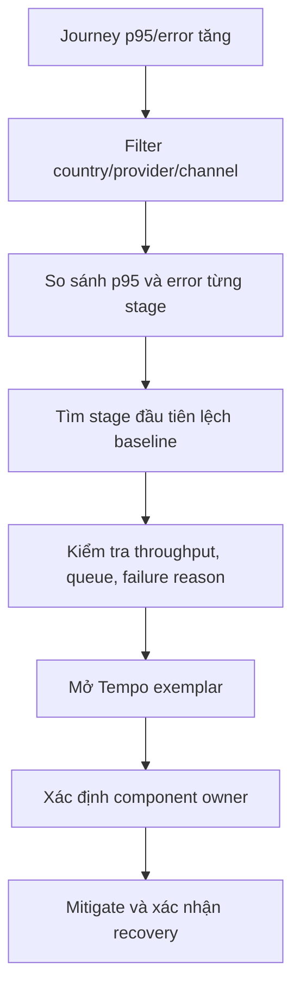
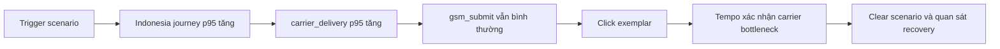

# Slide 1 — V-ID Observability Platform

## Từ “hệ thống đang lỗi” đến “lỗi ở đúng service nào”

**Phạm vi:** Authentication · OTP · Token · Authorization · Platform reliability  
**Stack:** Prometheus · Grafana · Alertmanager · OpenTelemetry · Tempo

**Kết quả nổi bật:**

- Xây dựng observability lab chạy end-to-end bằng Docker Compose.
- Chuẩn hóa KPI, metrics, dashboard, alerts và runbook.
- Theo dõi international OTP theo từng stage và drill-down tới trace waterfall.

<!-- Speaker notes:
Mở đầu bằng vấn đề vận hành: trước đây có thể biết OTP hoặc login đang lỗi, nhưng
khó xác định nhanh lỗi nằm ở gateway, IdP, Redis, queue hay provider. Dự án tạo ra
một lab hoàn chỉnh để chứng minh cách giải quyết trước khi kết nối UAT.
-->

---

# Slide 2 — 6 tính năng quan trọng của dự án

| # | Tính năng | Giá trị |
|---|---|---|
| 1 | Synthetic monitoring | Traffic và incident có thể lặp lại |
| 2 | KPI/SLI/SLO | Contract, error budget và burn rate |
| 3 | Metrics & alerting | Prometheus rules và Alertmanager |
| 4 | Dashboard drill-down | 9 dashboard, 83 panel |
| 5 | OTP bottleneck locator | Định vị international OTP theo 7 stage |
| 6 | Distributed tracing | Exemplar mở Tempo waterfall |

**Workflow thống nhất:** Detect → Localize → Prove → Alert → Recover.

<!-- Speaker notes:
Đây là slide agenda theo tính năng. Nhấn mạnh dự án không chỉ tạo dashboard mà
xây dựng một workflow hoàn chỉnh: tạo tín hiệu, chuẩn hóa KPI, phát hiện, định vị,
xác minh bằng trace và theo dõi recovery.
-->

---

# Slide 3 — Phạm vi kiến trúc V-ID



- `identity-provider`: authentication, OTP, session/profile, login/consent.
- Hydra: OAuth2/OIDC issuer; target architecture là Hydra-as-issuer.
- `oauth2-token`: component chuyển tiếp hướng tới Hydra front.
- `authz` + `organization`: organization-scoped authorization.
- Notification Center/GSM: external OTP delivery boundary.

<!-- Speaker notes:
Kiến trúc được đối chiếu với docs/v-id-intern-docs. Các tên auth-service,
otp-service trong simulator chỉ là synthetic aliases, không phải production
inventory.
-->

---

# Slide 4 — Kiến trúc observability đã xây dựng



- Metrics: phát hiện xu hướng, phạm vi và stage suy giảm.
- Traces: xác minh một request cụ thể bằng waterfall.
- Alerts: phát hiện symptom/SLO burn và route tới người xử lý.
- GitOps: toàn bộ dashboard, rules và config được quản lý như code.

<!-- Speaker notes:
Thông điệp chính: metrics và tracing không thay thế nhau. Metrics trả lời “ở đâu
đang có vấn đề trên diện rộng”; trace trả lời “request này đã mất thời gian ở đâu”.
-->

---

# Slide 5 — Tính năng 1: Synthetic monitoring

Đã xây dựng FastAPI service sinh dữ liệu synthetic cho:

- Authentication success/failure và latency.
- OTP send, delivery, verification, provider và queue.
- Token issuance và latency.
- Authorization decisions.
- HTTP, database, infrastructure và service health.
- International OTP journey theo từng stage.

Đặc điểm:

- Traffic profile theo thời gian, latency log-normal.
- Incident tự kích hoạt/phục hồi và scenario gọi qua API.
- Seed cố định để test có thể lặp lại.
- Không sinh PII hoặc secret trong metrics.

<!-- Speaker notes:
Simulator giúp dashboard có normal traffic, peak và incident thay vì dữ liệu random
không có quan hệ. Đây là nền tảng để kiểm thử ratio, p95, alert và recovery.
-->

---

# Slide 6 — Tính năng 2: KPI, SLI và SLO

| Nhóm | Chỉ số chính |
|---|---|
| Authentication | Success rate, latency dưới 500 ms |
| OTP | Provider submission, delivery receipt, verification |
| Token | Issuance success và latency theo issuer/grant |
| Platform | Availability của critical operations |
| Reliability | Error budget và multi-window burn rate |

Nguyên tắc đã chuẩn hóa:

- Numerator phải là tập con của denominator.
- Phân biệt business rejection với system failure.
- No-data khác 0% lỗi và khác 100% thành công.
- SLO trong lab là đề xuất; UAT/production cần owner phê duyệt bằng baseline thật.

<!-- Speaker notes:
Ví dụ wrong OTP không mặc định là platform outage. Provider accepted cũng không
đồng nghĩa SMS đã đến thiết bị; delivery receipt là một SLI riêng.
-->

---

# Slide 7 — Tính năng 3: Metrics và alerting

**Đã triển khai:**

- **62 recording rules** cho KPI, SLI, p95, error budget và burn rate.
- **17 alert rules** cho telemetry health, user journey, provider, queue và SLO.
- Rule unit tests cho normal/degradation/no-data/low-traffic.
- Alertmanager grouping, inhibition, severity routing và resolved notification.

```text
Raw metrics
→ rate / ratio / histogram_quantile
→ recorded KPI series
→ symptom & burn-rate alerts
→ Alertmanager
→ runbook / notification
```

<!-- Speaker notes:
Không alert chỉ vì CPU cao. Ưu tiên symptom mà người dùng cảm nhận được; resource
metric là context để điều tra. Critical inhibit warning cùng phạm vi để giảm noise.
-->

---

# Slide 8 — Tính năng 4: Dashboard drill-down

**9 dashboards · 83 panels**

- Overview.
- Authentication.
- MFA & OTP.
- OTP Journey.
- Token Lifecycle.
- Authorization.
- Platform & Dependencies.
- Reliability / SLO & Operations.
- Synthetic Cross-region Requests.

Dashboard hỗ trợ:

- Filter environment, cluster và bounded business dimensions.
- Drill-down từ overview đến service/stage.
- No-data handling, stable UID và provisioning tự động.
- Metrics-to-trace qua Prometheus exemplar.

<!-- Speaker notes:
Cross-region dashboard là generic synthetic scenario, không khẳng định V-ID có
datacenter ở từng nước. OTP Journey mới là dashboard bám sát service boundary.
-->

---

# Slide 9 — Tính năng 5: International OTP monitoring



**Điểm cần phân biệt:**

```text
API submission latency: request → provider accepted
SMS delivery latency:    provider accepted → delivery receipt
```

Số điện thoại quốc tế không đồng nghĩa request đi qua datacenter tại quốc gia đó.
Giải pháp đo theo service/dependency boundary thực tế.

<!-- Speaker notes:
Đây là insight quan trọng. Nếu provider trả 200 trong 300 ms nhưng receipt mất 15
giây thì V-ID synchronous path vẫn khỏe; vấn đề nằm downstream.
-->

---

# Slide 10 — Chia OTP journey thành 7 stage

| Stage | Thành phần quan sát |
|---|---|
| `edge_to_kong` | Ingress/Kong |
| `kong_to_idp` | Kong → Identity Provider |
| `redis_challenge` | Lưu OTP challenge |
| `route_selection` | Chọn channel/provider |
| `queue_wait` | Notification Center queue |
| `gsm_submit` | Provider API submission |
| `carrier_delivery` | Delivery receipt |

Nếu một stage lỗi, journey dừng tại đó và không sinh stage phía sau. Nhờ vậy có
thể xác định **boundary lỗi đầu tiên** và tránh đổ lỗi nhầm cho carrier.

<!-- Speaker notes:
Ví dụ không thấy carrier_delivery có thể do request đã chết ở Redis hoặc GSM
submit. Cần đọc terminal failure và throughput giữa các stage.
-->

---

# Slide 11 — Tính năng 6: Bottleneck detection và tracing



Chỉ kết luận khi có ít nhất hai tín hiệu đồng thuận:

- Stage p95 tăng + trace span chậm.
- Error ratio tăng + terminal timeout.
- Queue depth tăng + queue wait tăng.
- GSM submit nhanh + carrier delivery chậm.

<!-- Speaker notes:
Một trace chỉ là sample; không dùng một outlier để kết luận toàn hệ thống. Metrics
xác định pattern diện rộng, nhiều trace dùng để xác minh.
-->

---

# Slide 12 — Ví dụ kết quả từ trace waterfall

```text
POST /v1/auth/challenge                 12.40 s
├─ edge_to_kong                         0.02 s
├─ kong_to_idp                          0.05 s
├─ redis_challenge                      0.01 s
├─ route_selection                      0.004 s
├─ queue_wait                           0.07 s
├─ gsm_submit                           0.34 s
└─ carrier_delivery                    11.91 s
```

**Kết luận:**

- Internal V-ID stages nằm trong baseline.
- Provider nhận request trong 340 ms.
- Carrier delivery chiếm khoảng 96% tổng latency.
- Chuyển đúng incident tới owner provider/carrier thay vì đội IdP/Redis.

<!-- Speaker notes:
Đây là ví dụ quan trọng nhất khi demo. Mở dashboard, click exemplar và cho thấy
waterfall là bằng chứng bổ sung cho stage p95 trên Prometheus.
-->

---

# Slide 13 — Kịch bản demo trực tiếp

**Scenario:** làm chậm `carrier_delivery` của Indonesia trong 7 phút.



Demo cần thể hiện:

1. Trạng thái baseline.
2. Kích hoạt degradation.
3. Dashboard localize đúng stage.
4. Tempo xác minh request.
5. Alert firing và recovery sau khi clear.

<!-- Speaker notes:
Chuẩn bị scenario trước hoặc dùng thời lượng 420 giây. Do query dùng cửa sổ 5m,
đường biểu diễn và alert không hồi phục ngay lập tức sau khi clear.
-->

---

# Slide 14 — Chất lượng, bảo mật và giới hạn

**Quality gates:**

- Python/unit tests, dashboard contract tests.
- Prometheus rule/config tests.
- Alertmanager và Docker Compose validation.
- JSON/YAML validation, CI và GitOps workflow.

**Telemetry safety:**

- Không dùng phone, email, OTP, token, user/session/request ID làm metric labels.
- `trace_id` chỉ dùng cho exemplar/correlation.
- Labels và failure reasons có cardinality hữu hạn.

**Giới hạn:**

- Dữ liệu và traces hiện là synthetic.
- Một simulator đại diện cho nhiều service target.
- Threshold chưa phải production SLO.

<!-- Speaker notes:
Nêu rõ giới hạn để tránh hiểu demo là production-ready. Giá trị đã đạt là contract,
workflow và khả năng chứng minh end-to-end.
-->

---

# Slide 15 — Kết quả và bước tiếp theo

## Giá trị đã đạt được

- Có lab observability chạy end-to-end và tái hiện sự cố có kiểm soát.
- Chuẩn hóa KPI/SLI/SLO, metrics, dashboard, alerts và runbook.
- Xác định bottleneck OTP bằng cả metrics lẫn trace evidence.
- Tạo nền tảng kỹ thuật để tích hợp UAT thay vì bắt đầu từ con số 0.

## Đề xuất giai đoạn tiếp theo

```text
Owner xác nhận topology/SLI
→ instrument Kong và Go services
→ propagate traceparent qua HTTP/gRPC/Kafka
→ correlate provider callback
→ lấy UAT baseline
→ tune SLO/alerts
→ production rollout
```

> Thành quả chính: không chỉ biết OTP đang chậm, mà xác định được chậm ở đâu và
> cung cấp bằng chứng để chuyển đúng đội xử lý.

<!-- Speaker notes:
Kết thúc bằng đề nghị cụ thể: cần owner, quyền UAT, telemetry inventory và provider
callback contract. Đây là đầu vào để biến synthetic solution thành production.
-->
