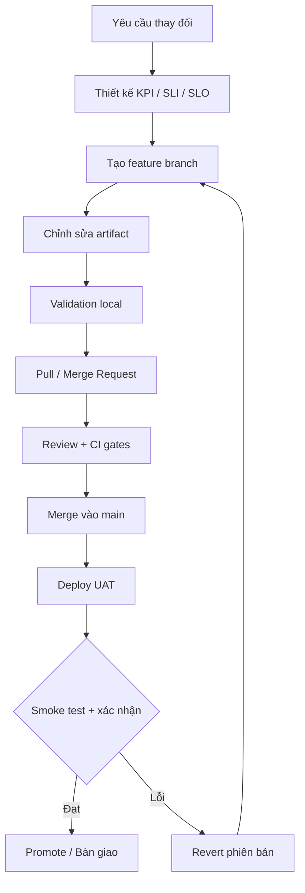

# Báo cáo tiến độ hoàn thành

> **V-ID Observability Platform**  
> Hệ thống giám sát tập trung cho V-ID SSO, xây dựng trên Prometheus, Grafana và Alertmanager.

---

## Tổng quan

| Hạng mục | Kết quả | Trạng thái |
|---|---:|:---:|
| Thiết kế và tài liệu nền tảng | Kiến trúc, KPI/SLI/SLO, tài liệu và runbook | ✅ |
| Metrics Simulator | 9 nhóm metrics và cơ chế mô phỏng sự cố | ✅ |
| Prometheus | 51 recording rules, 6 KPI, error budget và burn rate | ✅ |
| Cảnh báo | 11 alert rules và cấu hình Alertmanager | ✅ |
| Grafana | 7 dashboard, 65 panel | ✅ |
| GitOps | Quy trình từ feature branch đến UAT và bàn giao | ✅ |

## 1. Thiết kế và tài liệu nền tảng

- [x] Xây dựng kiến trúc monitoring cho V-ID bằng **Prometheus**, **Grafana** và **Alertmanager**.
- [x] Xác định 6 KPI chính: đăng nhập, độ trễ xác thực, OTP delivery, OTP verification, phát hành token và platform availability.
- [x] Soạn bộ KPI/SLI/SLO đề xuất.
- [x] Viết tài liệu Prometheus, Grafana, alerting, GitOps và quy trình triển khai.
- [x] Xây dựng cấu trúc repository và runbook xử lý sự cố.

### KPI, SLI và SLO

| KPI | SLI | SLO đề xuất |
|---|---|:---:|
| **Authentication success** | `auth_success_total / auth_requests_total` | ≥ 99,9% |
| **Authentication latency** | Số request ≤ 500 ms / tổng auth request | ≥ 95% dưới 500 ms |
| **OTP delivery success** | `otp_delivery_success_total / otp_send_total` | ≥ 95% |
| **OTP verification success** | `otp_verify_success_total / otp_verify_total` | Chưa chốt |
| **Token issuance success** | `token_issue_total / token_request_total` | ≥ 99,9% |
| **Platform availability** | `(http_requests_total - http_requests_5xx_total) / http_requests_total` | ≥ 99,9% |

> [!NOTE]
> SLO cho **OTP verification success** đang chờ thống nhất với các bên liên quan.

## 2. Metrics Simulator

- [x] Mô phỏng metrics cho authentication, OTP, token, authorization, HTTP, hạ tầng, database, provider và queue.
- [x] Mô phỏng traffic theo thời gian.
- [x] Sinh latency theo phân phối log-normal.
- [x] Hỗ trợ incident tự kích hoạt và tự phục hồi.
- [x] Bảo đảm counter tăng liên tục trong vòng đời process và không reset khi incident kết thúc.

## 3. Prometheus

- [x] Cấu hình scrape Metrics Simulator.
- [x] Xây dựng **51 recording rules**.
- [x] Theo dõi đủ 6 KPI trên các cửa sổ `5m`, `1h`, `6h`, `24h` và `30d`.
- [x] Tính error-budget remaining và burn rate cho các SLO được áp dụng.

## 4. Hệ thống cảnh báo

Đã xây dựng **11 alert rules**, bao phủ các nhóm sự cố:

- Mất metrics target hoặc lỗi recording rules.
- Không có eligible traffic.
- Fast burn và slow burn của SLO.
- Suy giảm authentication, latency, OTP, token và availability.
- OTP provider down và queue backlog.

Mỗi cảnh báo đều có đầy đủ metadata phục vụ vận hành:

| Metadata | Mục đích |
|---|---|
| `severity` | Phân loại mức độ nghiêm trọng |
| `team` | Xác định đội chịu trách nhiệm |
| `service` | Xác định dịch vụ bị ảnh hưởng |
| `dashboard` | Điều hướng đến dashboard liên quan |
| `runbook` | Điều hướng đến hướng dẫn xử lý |

- [x] Cấu hình Alertmanager cho môi trường local/UAT.
- [x] Viết runbook điều tra và xử lý cảnh báo.

## 5. Grafana

Đã xây dựng và tự động provision **7 dashboard**, tổng cộng **65 panel**:

1. **V-ID SSO — Tổng quan**
2. **Đăng nhập & Xác thực**
3. **MFA & OTP**
4. **Token Lifecycle**
5. **Phân quyền & Truy cập**
6. **Nền tảng & Phụ thuộc**
7. **SLO & Sự cố**

Dashboard hỗ trợ:

- Filter theo environment và cluster.
- Tùy chọn time range.
- Liên kết điều hướng giữa các dashboard.
- Datasource UID ổn định: `prometheus`.

## 6. Quy trình GitOps

---

## Kết quả bàn giao

Hệ thống monitoring V-ID đã hoàn thiện các thành phần cốt lõi từ thu thập metrics, tính toán SLI/SLO, cảnh báo, trực quan hóa đến quy trình triển khai GitOps. Các dashboard và alert rule đã sẵn sàng cho môi trường local/UAT.
