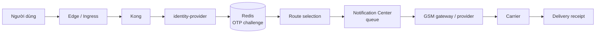
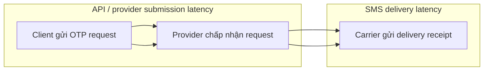
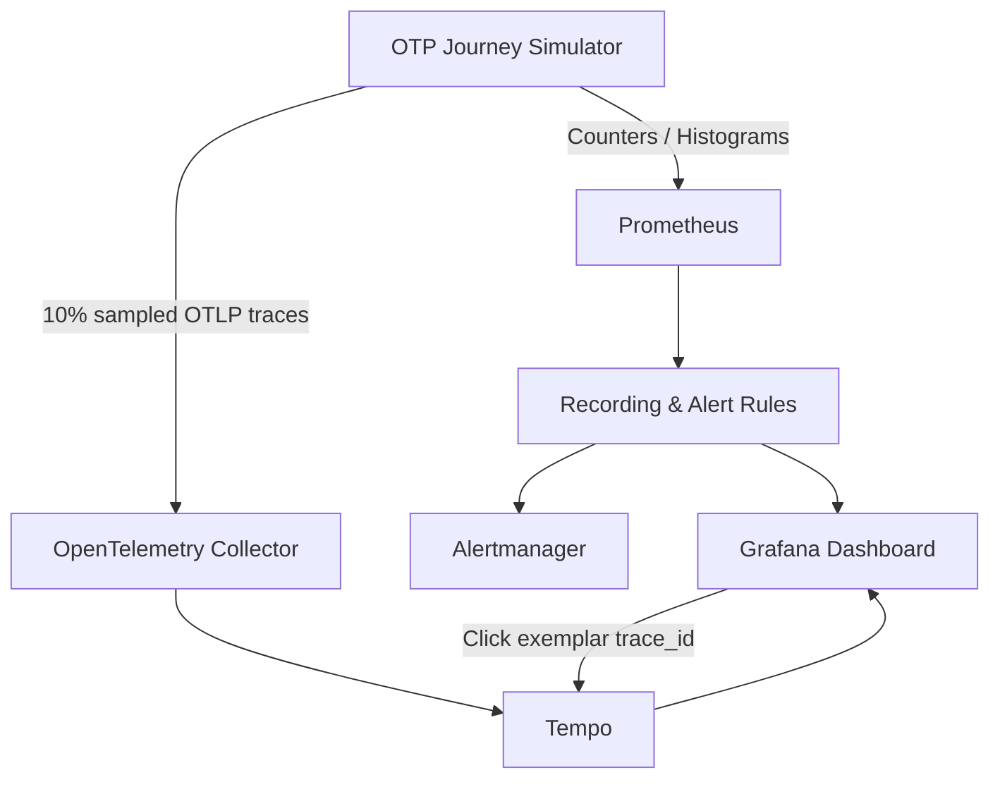
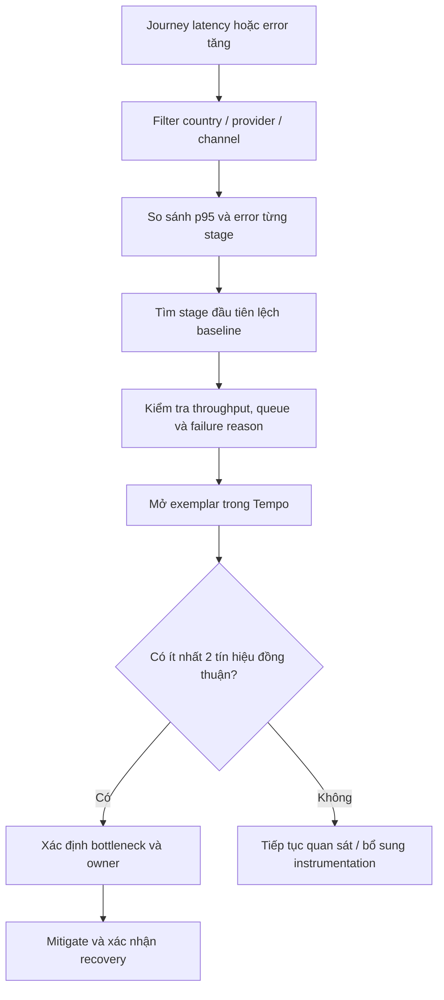
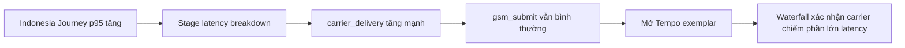
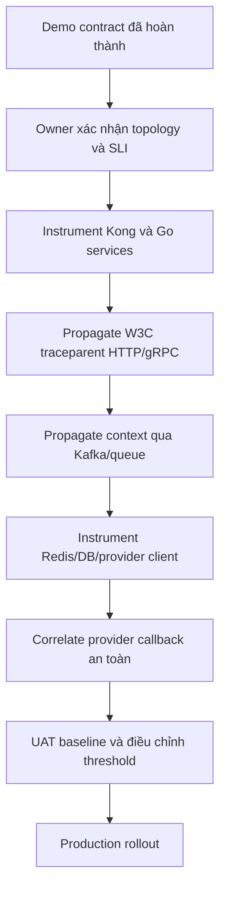

# International OTP Journey Monitoring

## 1. Tóm tắt giải pháp

Mục tiêu của hạng mục này là giúp đội vận hành trả lời nhanh câu hỏi:

> Khi người dùng đăng nhập bằng số điện thoại quốc tế và OTP đến chậm hoặc không
> đến, request đang bị nghẽn tại V-ID, hàng đợi gửi tin, GSM provider hay carrier?

Giải pháp kết hợp hai lớp quan sát:

- **Prometheus + Grafana** phát hiện country/provider/stage nào đang chậm hoặc lỗi
  trên toàn bộ traffic.
- **OpenTelemetry + Tempo** mở waterfall của một request được sample để xác minh
  chính xác thời gian tiêu tốn tại từng stage.

Kết quả của demo là một dashboard có thể chỉ ra vị trí nghi ngờ bottleneck, sau đó
đi từ biểu đồ tổng hợp tới trace chi tiết của request.

## 2. Bài toán cần giải quyết

Nếu chỉ đo tổng thời gian gửi OTP, hệ thống chỉ biết “OTP mất 12 giây” nhưng không
biết 12 giây đó nằm ở đâu. Trong khi một OTP journey đi qua nhiều boundary:



Có hai loại thời gian khác nhau cần phân biệt:



Provider trả response nhanh không đồng nghĩa người dùng đã nhận SMS. Vì vậy
delivery receipt được đo riêng với synchronous API path.

## 3. Phạm vi kiến trúc V-ID

Giải pháp được đối chiếu với tài liệu trong `docs/v-id-intern-docs`:

- `identity-provider` sở hữu luồng OTP.
- IdP dùng `RoutingSMSSender` để chọn channel/provider.
- Số +84 tiếp tục qua Notification Center.
- Destination được allowlist có thể route qua GSM; WhatsApp là channel riêng.
- Kong là gateway trên request path.
- Redis lưu trạng thái OTP challenge.

Quốc gia của số điện thoại không chứng minh V-ID có datacenter tại quốc gia đó.
Do đó giải pháp giám sát theo **service/dependency boundary thực tế**, không giả
định request đi qua “datacenter của nước nhận OTP”.

## 4. Cách giải pháp hoạt động

### 4.1 Chia request thành các stage

Mỗi OTP journey được chia thành bảy stage có thể đo độc lập:

| Stage | Thành phần | Câu hỏi được trả lời |
|---|---|---|
| `edge_to_kong` | Edge/Kong | Request có chậm trước gateway không? |
| `kong_to_idp` | Kong/IdP | Gateway gọi IdP có chậm không? |
| `redis_challenge` | Redis | Lưu OTP challenge có nghẽn không? |
| `route_selection` | IdP | Chọn Notification Center/GSM có bất thường không? |
| `queue_wait` | Notification Center | Message có nằm chờ lâu không? |
| `gsm_submit` | GSM/provider API | Provider có nhận request chậm/lỗi không? |
| `carrier_delivery` | Provider/carrier | SMS delivery receipt có đến chậm không? |

Nếu một stage lỗi, journey dừng tại stage đó và không tạo các stage phía sau. Điều
này giúp tìm được **stage lỗi đầu tiên**, thay vì hiểu nhầm stage không xuất hiện
là nguyên nhân sự cố.

### 4.2 Thu thập metrics và traces



- Metrics dùng để nhìn toàn cảnh: throughput, success rate, p95, errors và queue.
- Khoảng 10% journey được sample thành synthetic trace.
- Prometheus histogram gắn exemplar `trace_id`.
- Từ điểm bất thường trên Grafana có thể mở đúng trace trong Tempo.

## 5. Cách phát hiện bottleneck

Quy trình điều tra được chuẩn hóa như sau:



Không kết luận dựa trên một biểu đồ hoặc một trace đơn lẻ. Một kết luận đáng tin
cậy cần ít nhất hai tín hiệu, ví dụ:

- Stage p95 tăng và span tương ứng trong nhiều trace cũng chậm.
- Error ratio tăng và terminal failure có reason `timeout`.
- Queue depth tăng đồng thời queue-wait tăng.
- `gsm_submit` bình thường nhưng `carrier_delivery` tăng mạnh.

## 6. Ví dụ kết quả điều tra

### Trường hợp carrier giao SMS chậm

```text
POST /v1/auth/challenge                 12.40 s
├─ edge_to_kong                         0.02 s
├─ kong_to_idp                          0.05 s
├─ redis_challenge                      0.01 s
├─ route_selection                      0.004 s
├─ queue_wait                           0.07 s
├─ gsm_submit                           0.34 s
└─ carrier_delivery                    11.91 s
```

Kết luận:

- Kong, IdP, Redis và queue nằm trong baseline.
- Provider nhận request trong 340 ms.
- Carrier delivery chiếm khoảng 96% tổng latency.
- Bottleneck nghi ngờ nằm phía provider/carrier, không nằm trong V-ID synchronous
  request path.

### Trường hợp Notification Center backlog

```text
queue depth:       500 messages
queue_wait p95:    4.5 seconds
gsm_submit p95:    normal
```

Kết luận: request bị giữ trước khi gửi sang GSM; cần điều tra consumer throughput,
worker concurrency hoặc retry backlog của Notification Center.

### Bảng nhận diện nhanh

| Tín hiệu | Bottleneck nghi ngờ |
|---|---|
| `redis_challenge` tăng, trace dừng tại Redis | Redis/network/connection pool |
| Queue depth và `queue_wait` cùng tăng | Notification Center backlog |
| `gsm_submit` chậm/lỗi, receipt giảm | GSM/provider submission API |
| `gsm_submit` nhanh, `carrier_delivery` chậm | Provider/carrier delivery |
| Mọi country chậm tại `kong_to_idp` | Kong/IdP dùng chung |
| Chỉ một country/provider chậm | Route/provider cụ thể |

## 7. Nội dung đã hoàn thành

### Simulator

- Sinh journey tuần tự qua bảy stage.
- Latency dùng phân phối log-normal theo từng stage.
- Dừng journey tại terminal failure.
- Hỗ trợ degradation theo country và stage.
- Hỗ trợ queue-backlog scenario.
- Sample khoảng 10% journey thành trace.

### Prometheus

- End-to-end request count, success và latency.
- Per-stage request count, latency và error.
- Queue wait/depth.
- Provider delivery receipt và delivery duration.
- Recording rules tính rate, success ratio và p95.
- Alerts cho journey latency, stage degradation và missing receipt.

### Grafana và Tempo

- Dashboard **V-ID SSO — OTP Journey**.
- Filter environment, cluster, country, channel, provider và stage.
- Panel xác định stage bottleneck.
- Prometheus exemplar mở Tempo waterfall.
- Tempo `local-blocks` hỗ trợ Grafana Traces Drilldown và TraceQL metrics.

## 8. Dashboard dành cho demo

URL local:

```text
http://localhost:3000/d/sso-otp-journey
```

Các panel chính:

1. OTP journeys/second.
2. Journey success ratio.
3. End-to-end journey p95.
4. Delivery receipt p95.
5. Stage latency p95 — bottleneck locator.
6. Stage error ratio.
7. Terminal failures theo stage/service/reason.
8. Queue depth và queue-wait p95.
9. Journey latency có trace exemplars.

## 9. Kịch bản demo đề xuất

Kích hoạt carrier degradation cho Indonesia:

```bash
curl -X POST http://localhost:8000/api/simulation/warnings/otp-journey-degradation \
  -H 'content-type: application/json' \
  -d '{
    "duration_seconds": 420,
    "destination_region": "id",
    "hop": "carrier_delivery",
    "latency_multiplier": 5,
    "failure_rate": 0.15
  }'
```

Kết quả mong đợi trên dashboard:



Xóa scenario:

```bash
curl -X DELETE \
  http://localhost:8000/api/simulation/warnings/otp-journey-degradation
```

## 10. Kiến trúc triển khai local

```text
Metrics Simulator :8000
Prometheus        :9090
Alertmanager      :9093
Grafana           :3000
Tempo API         :3200
OTel Collector    :4317/4318 trong Docker network
```

Khởi động:

```bash
cd vid-observability-lab
cp .env.example .env
```

Đặt secret local trong `.env`:

```dotenv
GRAFANA_ADMIN_PASSWORD=admin
VID_SMTP_APP_PASSWORD=unused
```

```bash
python3 scripts/render-config.py --environment local
docker compose --env-file .env -f generated/local/docker-compose.yml up --build -d
```

Tempo không có web UI ở `http://localhost:3200/`; trả về 404 tại `/` là bình
thường. Trace được xem trong Grafana. Endpoint kiểm tra Tempo là `/ready`.

## 11. Metrics và recorded series

Metrics chính:

```text
otp_journey_requests_total
otp_journey_duration_seconds
otp_stage_requests_total
otp_stage_duration_seconds
otp_journey_failures_total
otp_delivery_reports_total
otp_delivery_duration_seconds
otp_queue_wait_duration_seconds
otp_queue_size
```

Recorded series:

```text
vid:otp_journey_requests:rate5m
vid:otp_journey_success:ratio5m
vid:otp_journey_latency:p95_5m
vid:otp_stage_latency:p95_5m
vid:otp_stage_error:ratio5m
vid:otp_delivery_latency:p95_5m
```

Prometheus labels chỉ chứa dimension bounded. Phone number, OTP, user ID,
challenge/request/session/trace ID và token không được dùng làm series labels.

## 12. Giới hạn hiện tại

Đây là demo observability contract, chưa phải distributed tracing production:

- Một simulator tạo metrics và spans mang tên nhiều service target.
- Country weights, latency, failure và thresholds là synthetic.
- Delivery receipt được mô phỏng, chưa kết nối provider thật.
- Dashboard generic cross-region không chứng minh production network topology.
- Alert threshold chưa được phê duyệt thành SLO production.

## 13. Bước tiếp theo khi tích hợp production



Cần thống nhất cách nối synchronous submission với asynchronous delivery callback,
ví dụ dùng span link hoặc correlation identifier đã qua privacy review. Không đưa
phone, OTP, token, cookie hoặc dữ liệu định danh vào telemetry chưa được security
và privacy owner phê duyệt.

## 14. Kết luận

Hạng mục đã chứng minh được quy trình:

```text
Phát hiện symptom bằng metrics
→ thu hẹp theo country/provider
→ tìm stage đầu tiên lệch baseline
→ xác minh request bằng Tempo waterfall
→ xác định component owner
→ theo dõi recovery
```

Giá trị chính của giải pháp không chỉ là biết OTP chậm, mà là chỉ ra được OTP chậm
ở đâu và cung cấp bằng chứng metrics + trace để chuyển đúng đội xử lý.
